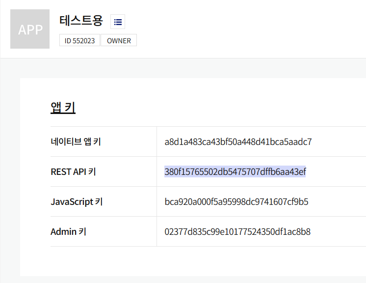
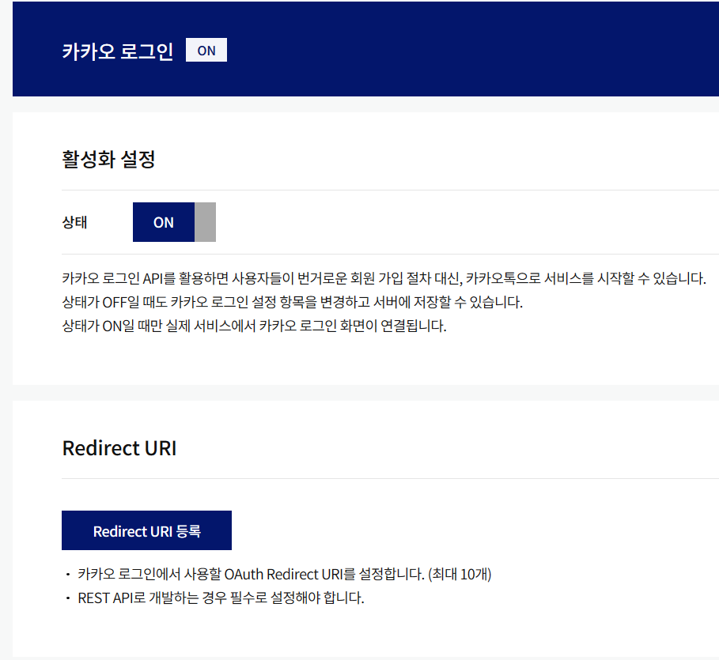
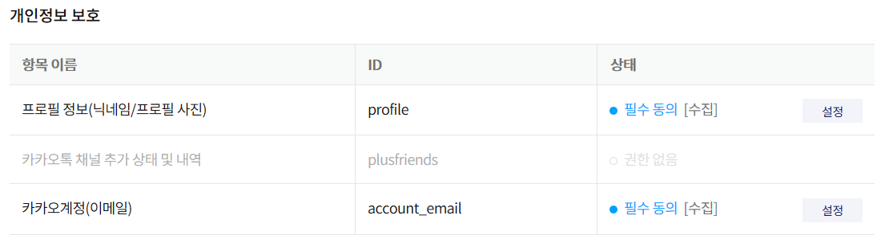
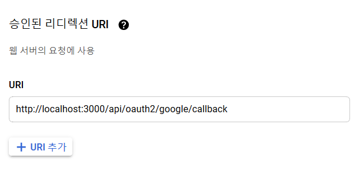

# GuwonGwaja

### 호두과자님을 구원하기 위한 레포입니다.

## env 파일 세팅

`KAKAO_API_KEY`

https://developers.kakao.com/console/app 에 접속하여 로그인후, 
자신의 애플리케이션을 생성합니다.

REST API 키를 복사하여 env 파일에 삽입하면 됩니다.

그리고 좌측 메뉴에 `카카오 로그인` 을 클릭하여

활성화 설정을 ON 으로 변경해주시고, Redirect URI는 [host]/api/oauth2/kakao 로 해주시면 됩니다

`ex) http://localhost:3000/api/oauth2/kakao`

또한, 카카오 로그인 메뉴 아래에 `동의항목` 을 클릭하여

프로필 정보와 카카오계정을 필수 동의로 바꿔주시면 됩니다.

`GOOGLE_API_CLIENT_ID & GOOGLE_API_CLIENT_SECRET`

https://console.cloud.google.com/ 에 접속하여 로그인후, 좌측 메뉴에

`API 및 서비스 -> 사용자 인증 정보` 에 접속.

`상단에 사용자 인증 정보 만들기` 를 누르고, `OAuth 클라이언트 ID` 를 눌러주세요.

자신이 원하는 세팅의 애플리케이션을 생성한 뒤, CLIENT_ID와 CLIENT_SECRET을 env 파일에 넣어주세요.

그리고 앱 정보에 REDIRECT_URI을 아까와 같이 추가해주세요.

`HOST`

HOST 정보는 도메인 네임을 적어주시면 됩니다.

`ex) http://localhost:3000`